  

山东大学集成电路学院在读本科生，喜欢折腾服务器、机器人和单片机，欢迎交流学习 ✨
Undergraduate student at SDU School of Integrated Circuits. Love tinkering with servers, bots & MCUs. Happy to chat!

- 🔭 在搞：savrc3.icu 服务器服务、[课表备忘录](https://github.com/Savrc3/course-schedule-widget)（[下载安装包](https://github.com/Savrc3/course-schedule-widget/releases)）
- 🌱 在学：STM32 单片机、数字电路、IC 设计
- 📫 联系：Savrc3@qq.com · B站 Savrc3

